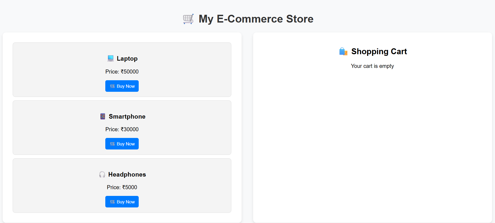
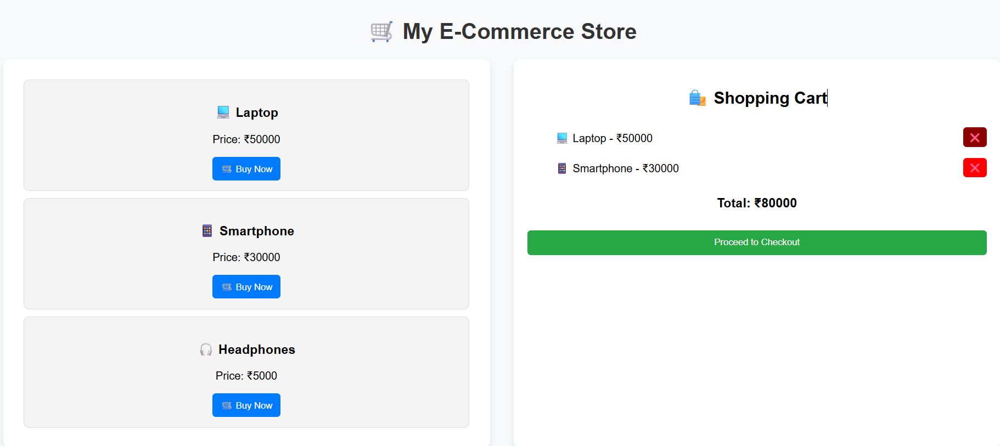
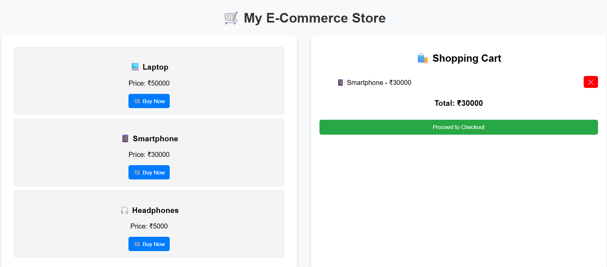

# 🛒 E-commerce Product UI

🧾 A responsive and dynamic e-commerce product listing interface built with React.
📦 Created to practice frontend development concepts like component reuse and dynamic rendering.
🌐 Live Demo: [https://d-ecom.vercel.app/]

<div align="center">
  
  
  
</div>

---

## ✨ Features

* 🖼️ Product image, name, price & rating display
* 🧩 Reusable React components
* 🧠 Simple props-based data rendering
* 💻 Fully responsive layout (customizable)

---

## 📸 Screenshot





---

## 🚀 Run This Project Locally

### ⚙️ Prerequisites

* Node.js (v16 or higher)
* npm (Node Package Manager)

### 📥 Installation Steps

```bash
# 1. Clone the main repo
git clone https://github.com/dhruvgit-27/basic-projects.git

# 2. Navigate into the ecommerce folder
cd basic-projects/ecommerce

# 3. Install dependencies
npm install

# 4. Start the development server
npm start
```

🌐 The app will open at: [http://localhost:3000](http://localhost:3000)

---

## 📁 Project Structure

```
ecommerce/
├── public/
├── src/
│   ├── components/
│   └── App.js
├── package.json
└── README.md
```

---

## 🧠 What I Learned

* Dynamic rendering of data using props
* Reusable React components
* Basic layout structuring with CSS
* Clean separation of UI logic

---

## 👨‍💻 Author

Dhruv Pratap Singh
📬 GitHub: [@dhruvgit-27](https://github.com/dhruvgit-27)

---

## 💬 Want to Contribute?

This is a beginner-level UI project. Feel free to fork and:

* Add filters or search functionality
* Improve styling with Tailwind/Bootstrap
* Add cart integration for fun!

<p align="center"> Made with ❤️ using React </p>
