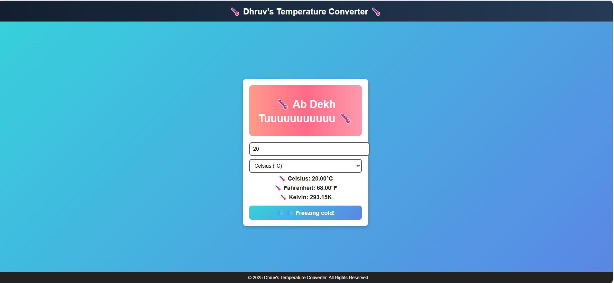
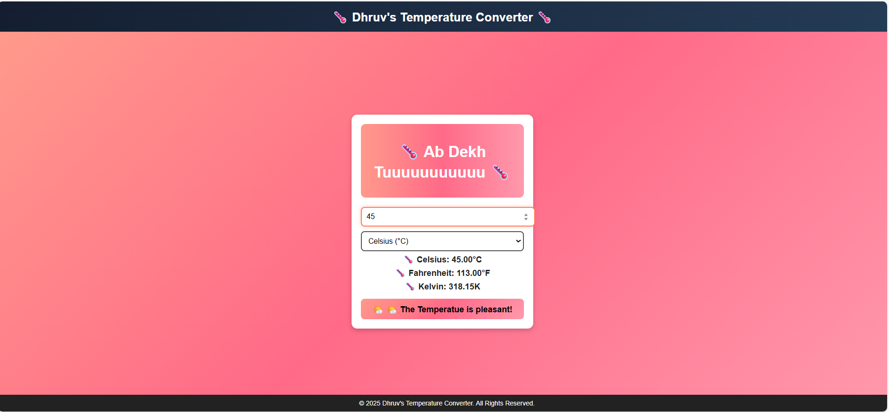
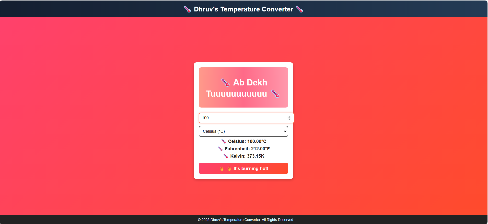

<h1 align="center">🌡️ Temperature Converter</h1>

  🔁 Convert temperatures between Celsius, Fahrenheit and Kelvin using a simple React app. 
  📚 Built as part of my development training to understand React fundamentals.
  🌐 Live Demo: [https://k-c-ftemp-converter.vercel.app/]

  
  
  

---

## ✨ Features

- 🔥 Real-time temperature conversion
- 🧠 Clean state management using React Hooks
- 💡 Beginner-friendly code structure
- 💻 Responsive UI (customizable)

---

## 📸 Screenshot

---

🚀 Run This Project Locally

⚙️ Prerequisites

Node.js (v16 or higher)

NPM (Node Package Manager)

---

📥 Installation Steps

# 1. Clone the main repo
git clone https://github.com/dhruvgit-27/basic-projects.git

# 2. Move into this project folder
cd basic-projects/temperature

# 3. Install all dependencies
npm install

# 4. Run the app
npm start

🌐 The app will open at http://localhost:3000

---

*** Or Not in mood to do this hardwork, no problem I got you covered. ***

👉 Click this Vercel Link: https://k-c-ftemp-converter.vercel.app/

---

📁 Project Structure

temperature/

├── public/

├── src/

├── package.json

├── package-lock.json

└── README.md

---

🧠 What I Learned

🔹 Component-based architecture

🔹 Handling input and output

🔹 React state & events

🔹 Real-world UI logic

---

👨‍💻 Author

Dhruv Pratap Singh

📬 GitHub: @dhruvgit-27

---

💬 Want to Contribute?

This is a beginner project. Feel free to fork it and:

Add styling with Tailwind or Bootstrap

Improve UI

Anything you find more interesting 

---

 Made with ❤️ using React 
 